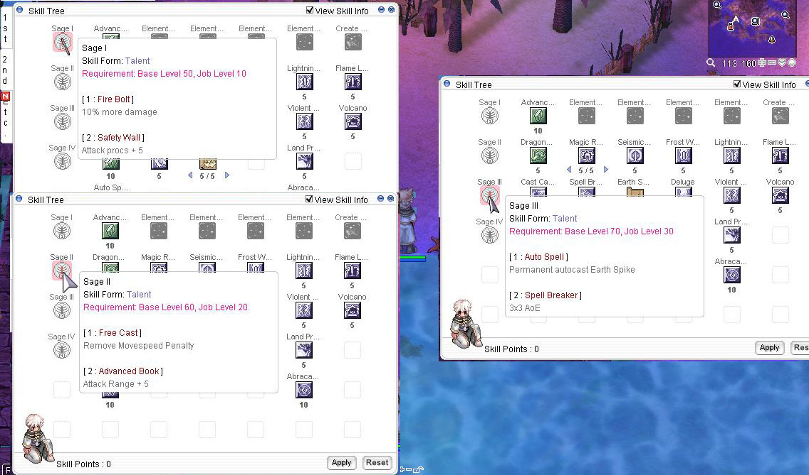

# Core Features

Though the server is highly customized, these changes will mainly affect play styles and character builds.

We will not include Automated Events, GM Hosted events, yada, yada just to fill out this page because they're not features, they're a must-have.

Note that ALL of these changes are subject to balancing and modifications, heck even disable if necessary.

See [Gameplay Changes](gameplay-changes.md) for general server information.

## :material-arrow-right-box:{ .mybullets } Class Rebalance

Along with all the core features, we have introduced a few skill balancing. As dual client is enabled, we have bump priest class more so priest main can enjoy the class fully. <em>Note that all of the balancing is subject to change</em>.

=== "General Changes"

    *  __Play Dead__ can now be used by all classes but restricted to towns only
    *  __Vending__ is now an inherent skill. Rescaled to max level 1. Max vending items: 8
    *  __Knapsack__ renamed from Increase Weight Limit R (Gympass). Added to novice skill tree for visibility
    * __1st Job Platinum Skills__ quests now does not have base and job level requirements
    * __2nd Job Platinum Skills__ are disabled temporarily

=== "Swordsman"

    *  __Bash__ sp cost rescaled from 8/8/8/8/8/15/15/15/15/15 to 5 + 1 per skill level
    *  __Increase HP Recovery__ regen ticks from 10 seconds to 5
    *  __Bowling Bash__ removed gutter line mechanics
    *  __Shield Boomerang__ damage rescaled from 100% + 30% per skill level to 110% + 30%. Removed bonus damage from shields' weight

=== "Mage"

    *  __Increase SP Recovery__ regen ticks from 10 seconds to 5
    *  __Sense__ removed from the game
    *  __Dragonology__ damage to dragon type monster rescaled from 4% per skill level to 5%. INT gain rescaled from 1/1/2/2/3 to 1 per skill level
    *  __Abracadabra__ summoning skills are disabled. Now only requires 1 Yellow Gemstone instead of 2

=== "Archer"

    *  __Falconry Mastery__ now an acitve skill. Displays the current chance of triggering an automatic Blitz Beat when attacking.

=== "Acolyte"

    *  __Increase Agi__ removed HP cost
    *  __Angelus__ changed from a regular skill to a party buff skill. Automatically learned at job change
    *  __Gloria__ duration increased from 10 + 5 to 10 + 10 per skill level(max of 60 seconds). SP cost from 20 to 15 + 5 per skill level
    *  __Mace Mastery__ now affects book type weapons
    *  __Magnus Exorcismus__ now deals holy damage to all monsters (does not include players)
    *  __Sanctuary__ heal is now uncapped (from 777 at level 7) but rescaled from 111 to 99 per skill level
    *  __Suffragium__ cast time reduction decreased from 15% to 10% per skill level. Now linger for the whole duration of the buff and does not get removed when user casts a skill
    *  __Body Relocation__ cannot be used when trapped by Ankle Snare

=== "Merchant"

    *  __Discount__ removed from the game
    *  __Overcharge__ removed from the game
    *  __Item Appraisal__ removed from the game as equips now drop identified
    *  __Pushcart Mastery__ renamed from Pushcart.
    *  __Crazy Uproar__ changed from a platinum skill to a party buff skill. Automatically learned at job change
    *  __Cart Revolution__ changed from a platinum skill to regular skill. Removed cart weight damage bonus. Max level 10. Damage: 130% + 15% per skill level
    *  __Wood Cutter__ new passive skill. Increase ATK against Plant and Formless monsters
    *  __Axe Boomerang__ new active skill. Throws Axe at range, dealing damage and knock-back. Max level 5. Damage: 250% + 50% per skill level. Range: 4 + 1 per skill level. 5 second cooldown.
    *  __Buying Store__ is now a platinum skill. Now does not require Buyer License.
    *  __Change Cart__ removed from the game
    *  __Smith Skills__ reworked:
        *   Prerequisites removed. Can now be learned freely.
        *   As stated in [Addressing Multi-Client Dilemma](/gameplay-changes/#addressing-multi-client-dilemma), the Success Rate is now determined by Base Level, Job Level, Base DEX, and Base LUK. This change has replaced the old method of gathering friends (or alts), buffing the forger/brewer extensively for stats, and then finally crafting. This allows not only competitive Smiths and Alchemist to rank higher but also caters to casual players.
    *  __Homunculus__ disabled evolution temporarily and will be enabled if community deems not overpowered and exploitable.
    *  __Pharmacy__ reworked:
        *   Will now create multiple potions depending on the available quantity in the inventory.
        *   Renamed Slim Potions to Tonic. As all items now weigh 1, Tonics have been revamped to provide a 5-10% more heal from original Potions.
        *   The same with Smith skills, the chance to produce a potion is now determined by Base Level, Job Level, Base DEX, and Base LUK. 
        *   SP cost increased from 5 to 15. Cooldown: 2 seconds.
    *  __Twilight Alchemy Skills__ removed from the game

=== "Thief"

    *  __Left-Hand Mastery__ damage regain increased from 30% + 10% to 50% + 10% per skill level
    *  __Katar Mastery__ now provides 1 CRIT per level
    *  __Compulsive Discount__ removed from the game

## :material-arrow-right-box:{ .mybullets } Custom Party Buffs

In an effort to promote the Party System and encourage players to team up with others, we have implemented a new feature that gives each class a party skill upon job change.

Expanded Classes Coming Soon!

- Swordsman <video width="480"  controls><source src="/videos/sm_courage.mov" type="video/mp4"></video>  <strong>Courage</strong> <em>MaxHP + 200, MaxHP + 5%</em>
- Mage <video width="480"  controls><source src="/videos/mg_mindconquer.mov" type="video/mp4"></video>  <strong>Mind Conquer</strong> <em>Reduce Cast delay by 10%</em>
- Archer <video width="480"  controls><source src="/videos/ac_eagle.mov" type="video/mp4"></video>  <strong>Eagle's Eye</strong> <em>Dex + 4, Luk+4</em>
- Acolyte <video width="480"  controls><source src="/videos/al_angelus.mov" type="video/mp4"></video>  <strong>Angelus</strong> <em>Def + 50%</em>
- Merchant <video width="480"  controls><source src="/videos/mc_loud.mov" type="video/mp4"></video>  <strong>Crazy Uproar</strong> <em>Str + 4, Atk + 30</em>
- Thief <video width="480"  controls><source src="/videos/tf_overdrive.mov" type="video/mp4"></video>  <strong>Overdrive</strong> <em>Aspd + 10%, Crit + 3</em>

## :material-arrow-right-box:{ .mybullets } Multiclass

Allow your character to master other classes by unlocking them. Unlocking a different class and reaching a Job Level of 50 will grant your character a permanent stat bonus.

-  __Knight__ Str + 2
-  __Crusader__ Vit + 2
-  __Priest__ Vit + 2
-  __Monk__ Int + 2
-  __Wizard__ Int + 2
-  __Sage__ Dex + 2
-  __Blacksmith__ Luk + 2
-  __Alchemist__ Str + 2
-  __Hunter__ Dex + 2
-  __Bard/Dancer__ Agi + 2
-  __Assassin__ Agi + 2
-  __Rogue__ Luk + 2
- __Expanded Classes__ <small>Not yet implemented</small>

Talk to the Adventurer's Guildmaster in Headquarter to unlock a class.

## :material-arrow-right-box:{ .mybullets } Class Talent Tree <small><em>Choose your branch!</em></small>

We have unveiled a new way to help players adapt to the needs of each battle, offering powerful augmentations to their skill set.

Select your Class Talents at Job Levels 10/20/30/40 to gain special, passive bonuses to your abilities. Each tier offers unique branches <em>(Branch 1 or Branch 2)</em>, and bypassed branches are not available at future levels. Each class has their own unique set of Talents to choose from.

This feature will make unconventional builds more viable, such as Attack Priests and Sages, Blitzers, and Crit Knights.

<small><em>This photo is a teaser. Talent upgrades are not yet final</em></small>

## :material-arrow-right-box:{ .mybullets } Headgear Blueprints

Unlock a world of creativity and style with our innovative Blueprint feature! Venture into the wilds and obtain headgear blueprints unique to each monsters, just like collecting cards.

Blueprints list the materials required and allow you to craft unique headgears. Embrace the power of craftsmanship and become a legendary headgear collector*!

Headgears crafted from Blueprints are slotted and can be converted into costumes. 

<iframe width="560" height="315" src="https://www.youtube.com/embed/Rmoyo7w7zQI?si=etwQSTBACsriPVCW" title="YouTube video player" frameborder="0" allow="accelerometer; autoplay; clipboard-write; encrypted-media; gyroscope; picture-in-picture; web-share" referrerpolicy="strict-origin-when-cross-origin" allowfullscreen></iframe>

<small>Note: <em>*Converted costumes (as well as cards) can be inserted to your Adventurer's Album - coming soon!</em></small>

## :material-arrow-right-box:{ .mybullets } Revamped Instances

While not yet implemented, we are thrilled to announce that we have prepared revamped instances for your enjoyment, including iconic locations like the Endless Tower and Thanatos Tower, among others.

Keep a lookout for these exciting releases!

## :material-arrow-right-box:{ .mybullets } And More!

There are many features more planned <small><em>PvP and GvG players:wink::wink:</em></small> but we try not to spoil, teehee. And as always, we are very open to feedback and suggestions. If you have any, please do not hesitate to drop it on our Discord.

Stay posted on our discord channel or this page for updates!

See [Gameplay Changes](gameplay-changes.md) for general server information.